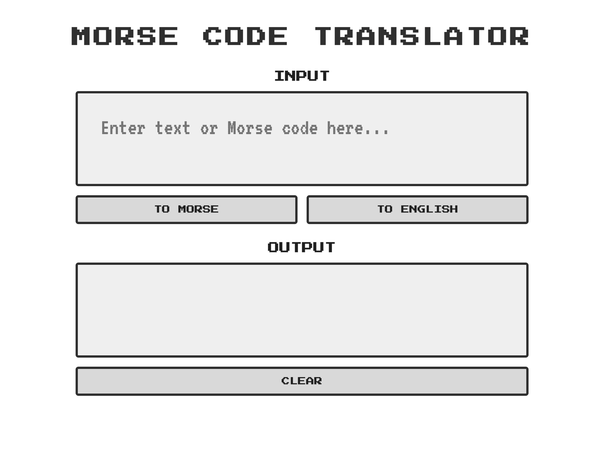

# Morse Code Translator

A responsive web application that translates English text to Morse code and Morse code to English.

## Screenshot

## Built With

- HTML5
- SCSS
- JavaScript (ES6 Modules)
- JSON
- Jest
- Babel

## Key Concepts

- DOM manipulation
- Async/await and data fetching
- JSON data handling
- Regular expressions for input validation
- Unit testing with Jest

## How It Works

1. Enter English text or Morse code.
2. Choose the translation direction.
3. The application validates the input and displays the translated result.

## Future Improvements

- Auto-detect input language
- Copy-to-clipboard button
- Support for numbers and punctuation
